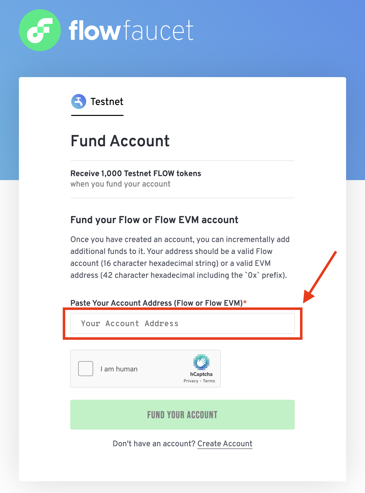

# Fullstack NFT Dapp on Flow EVM Testnet

Building a Fullstack NFT Dapp on Flow EVM Testnet from scratch using Solidity and Hardhat for Smart Contracts, EthersJS & ReactJS.

## Full video Guide 
 
<iframe src="https://drive.google.com/file/d/1DpRiI-r2h-ugJIBPQVgWGH_5MGx35I5Y/preview" width="640" height="360" allow="autoplay"></iframe>


# Description

This tutorial will guide you through building a fullstack NFT DApp on the Flow EVM testnet. You will learn how to deploy smart contracts using Hardhat, interact with them using Ethers.js, and build a frontend using ReactJS. By the end of this tutorial, you will have a working NFT DApp that allows users to mint and manage their NFTs.

## Objectives

After completing this guide, you'll be able to:

- Deploy and interact with smart contracts on the Flow EVM testnet using Hardhat.
- Use Ethers.js to interact with the blockchain from a ReactJS frontend.
- Build a simple frontend to display and interact with NFTs.
- Implement wallet connectivity and transactions.
- Understand the basics of NFT standards and smart contract development.

## Prerequisites

- [NodeJS](https://nodejs.org/) installed on your machine.  
- [MetaMask](https://metamask.io/) or another [Ethereum wallet](https://ethereum.org/en/wallets/find-wallet/) installed in your browser for wallet connectivity.  
- Basic knowledge of [Solidity](https://soliditylang.org/), [Ethereum](https://ethereum.org/), and [ReactJS](https://reactjs.org/).  

## Tech Stack

| Technology | Description |  |
|------------|-------------|------|
| **[Hardhat](https://hardhat.org/)** | Smart contract development environment |  |
| **[Solidity](https://soliditylang.org/)** | Ethereum's smart contract programming language |  |
| **[ReactJS](https://reactjs.org/)** | Frontend framework for building UI |  |
| **[Flow EVM Testnet](https://developers.flow.com/evm/about)** | Test environment for deploying Solidity smart contracts |  |


## Part 1 - Building ERC721 smart contract using Solidity and Hardhat

In this part, you will learn how to create an ERC721 [Non Fungible Token Standard] smart contract using Solidity and Hardhat. You will deploy the smart contract to the Flow EVM testnet using Ethers.


### Installing And Initializing our Hardhat Project 

 Initialize a new Node.js project and install the required dependencies:

```bash
mkdir nftonflow
cd nftonflow
mkdir hardhat
cd hardhat
npm init -y
```

Install Hardhat and the required packages required for ERC721 contract deployment:

```bash
npm install --save-dev hardhat
npx hardhat init 
```

Create an empty *hardhat.config.js* file in the root directory of your project:


Create a new directory for your smart contracts and create a new Solidity file for your ERC721 contract:

```bash
mkdir contracts
cd contracts
touch SimpleNFT.sol
```

Add the following code to the SimpleNFT.sol file:

We would be creating a simple ERC721 contract that allows users to mint NFTs. 
- The contract will have a tokenCounter to keep track of the number of tokens minted,
- A baseURI to store the base URI for the token metadata
- A constructor to initialize the contract with the base URI,
- A getTokenURI function to return the base URI, and
- A mintNFT function to mint NFTs.

The NFT contract would have following features 
- Minting an NFT will require the user to send 0.01 ether,
- Only one NFT can be minted per wallet. 
- The contract will have a token limit of 5 NFTs.


```solidity
// SPDX-License-Identifier: MIT
pragma solidity 0.8.26;

import "@openzeppelin/contracts/token/ERC721/ERC721.sol"; // Import the ERC721 contract from OpenZeppelin

contract SimpleNFT is ERC721 {
    uint256 public tokenCounter; // Keep track of the number of tokens minted
    string public baseURI; // Base URI for the token metadata

   // Constructor to initialize the contract with the base URI
    constructor(string memory _baseURI) ERC721("SimpleNFT", "SNFT") { 
        tokenCounter = 0;
        baseURI = _baseURI;
    }
   // Function to return the base URI 
    function getTokenURI() public view returns (string memory) {
        return baseURI;
    }
   
    function mintNFT(address recipient) public payable {
        require(tokenCounter < 5, "Token limit reached");
        require(msg.value == 0.01 ether, "Incorrect amount sent");
        require(balanceOf(recipient) == 0, "Only one NFT per wallet");
        _safeMint(recipient, tokenCounter);
        tokenCounter++;
    }
}
```

Install the OpenZeppelin contracts library, ethers, hardhat-toolbox and dotenv packages:

```bash
cd ..
npm install @openzeppelin/contracts ethers dotenv @nomicfoundation/hardhat-toolbox
```

Set up the dotenv file to store your private key [  Warning! : Do not push this file to Github, add it to .gitignore before pushing as you might lose all your funds. Always use a testnet account for development purposes]

```bash
touch .env
```

Add your private key to the .env file:

```bash
FLOW_EVM_PRIVATE_KEY=YOUR_PRIVATE_KEY
```


Setup the hardhat.config.js file to configure the Flow EVM test network and import the required plugins:

```javascript
require('@nomicfoundation/hardhat-toolbox');
require('dotenv').config();
module.exports = {
  solidity: '0.8.26',
  networks: {
    flowEVM: {
      url: 'https://testnet.evm.nodes.onflow.org',
      accounts: [process.env.FLOW_EVM_PRIVATE_KEY],
    },
  },
};
```
Now lets write the deployment script for our ERC721 contract

Create a new directory for your scripts and create a new file named deploy.js:

```bash
mkdir scripts
cd scripts
touch deploy.js
```

Add the following code to the deploy.js file:

This will deploy the SimpleNFT contract to the Flow EVM testnet and log the contract address to the console.
It will also set the base URI for the contract to the Flow Logo URL.
```javascript
const { ethers } = require('hardhat');
require('dotenv').config();

async function main() {
  const [deployer] = await ethers.getSigners();

  console.log('Deploying contract with the account:', deployer.address);
  const NFTImage = 'https://cryptologos.cc/logos/flow-flow-logo.png';
  const SimpleNFT = await ethers.getContractFactory('SimpleNFT');
  const simpleNFT = await SimpleNFT.deploy(NFTImage);

  await simpleNFT.waitForDeployment();
  const contractAddres = await simpleNFT.getAddress();
  console.log(
    'SimpleNFT deployed to:',
    `https://evm-testnet.flowscan.io/address/${contractAddres}`
  );
}

main()
  .then(() => process.exit(0))
  .catch((error) => {
    console.error(error);
    process.exit(1);
  });
```
Its time to deploy our contract to the Flow EVM testnet

Before deploying grab some testnet FLOW tokens from the faucet - https://faucet.flow.com/fund-account 



Run the compilation and deployment script using Hardhat:

```bash
cd ..
npx hardhat compile
npx hardhat run scripts/deploy.js --network flowEVM
```

You should see the contract address logged to the console:

```bash
Deploying contract with the account: 0x...
SimpleNFT deployed to: https://evm-testnet.flowscan.io/address/0x...
```

Congratulations! You have successfully deployed an ERC721 smart contract to the Flow EVM testnet using Hardhat.


## Part 2 : Interacting with the ERC721 contract using Ethers.js and building a simple frontend with ReactJS

In this part, you will learn how to interact with the ERC721 smart contract deployed on the Flow EVM testnet using Ethers.js. You will build a simple frontend using ReactJS to display the NFTs and allow users to mint new NFTs.

### Setting up the ReactJS frontend

Create a ReactJS project using Create React App in the same directory as your Hardhat project:
install and setup tailwindcss, ethers, lucide-react for the frontend
```bash
cd ..
npx create-react-app frontend
cd frontend
npm install tailwindcss@3 ethers lucide-react
npx tailwindcss init -p
```


On the src/App.js file and replace the existing code with the following:

```javascript
/** @format */

import { useState, useEffect } from 'react';
import { ethers } from 'ethers';
import NFTJson from './artifacts/contracts/simpleNFT.sol/SimpleNFT.json';
import { Loader2, Wallet, Sparkles, ExternalLink } from 'lucide-react';

const CONTRACT_ADDRESS = '0xE6D66A08F0C4A6A80D05FDdD7Bdf6dFda023422F';

export default function NFTMint() {
  const [account, setAccount] = useState(null);
  const [provider, setProvider] = useState(null);
  const [contract, setContract] = useState(null);
  const [nfts, setNfts] = useState([]);
  const [isConnecting, setIsConnecting] = useState(false);
  const [isMinting, setIsMinting] = useState(false);
  const [mintSuccess, setMintSuccess] = useState(false);
  const [IMAGE_URI, setImageURI] = useState(null);

  useEffect(() => {
    if (window.ethereum) {
      const web3Provider = new ethers.BrowserProvider(window.ethereum);
      setProvider(web3Provider);
    }
  }, []);

  useEffect(() => {
    const fetchBaseURI = async () => {
      if (contract) {
        try {
          const baseURI = await contract.getTokenURI();
          console.log(baseURI); // Adjust method name based on your contract
          setImageURI(baseURI);
        } catch (error) {
          console.error('Error fetching baseURI:', error);
        }
      }
    };

    fetchBaseURI();
  }, [contract]);

  const connectWallet = async () => {
    if (!provider) return;
    setIsConnecting(true);
    try {
      const signer = await provider.getSigner();
      const address = await signer.getAddress();
      setAccount(address);
      const nftContract = new ethers.Contract(
        CONTRACT_ADDRESS,
        NFTJson.abi,
        signer
      );
      setContract(nftContract);
      fetchNFTs(address, nftContract);
    } catch (error) {
      console.error('Connection failed', error);
    } finally {
      setIsConnecting(false);
    }
  };

  const getTokenURI = async () => {
    if (!contract) return;
    try {
      const tokenURI = await contract.get();
      setImageURI(tokenURI);
    } catch (error) {
      console.error('Fetching token URI failed', error);
    }
  };

  const mintNFT = async () => {
    if (!contract) return;
    setIsMinting(true);
    setMintSuccess(false);
    try {
      const tx = await contract.mintNFT(account, {
        value: ethers.parseEther('0.01'),
      });
      await tx.wait();
      fetchNFTs(account, contract);
      setMintSuccess(true);
      setTimeout(() => setMintSuccess(false), 3000);
    } catch (error) {
      console.error('Minting failed', error);
    } finally {
      setIsMinting(false);
    }
  };

  const fetchNFTs = async (address, nftContract) => {
    if (!nftContract) return;
    try {
      const balance = await nftContract.balanceOf(address);
      const mintedNFTs = [];
      for (let i = 0; i < balance; i++) {
        mintedNFTs.push(i);
      }
      setNfts(mintedNFTs);
    } catch (error) {
      console.error('Fetching NFTs failed', error);
    }
  };

  const truncateAddress = (address) => {
    return `${address.slice(0, 6)}...${address.slice(-4)}`;
  };

  return (
    <div className="min-h-screen flex flex-col items-center justify-center bg-black text-white p-6">
      <div className="w-full max-w-md">
        <div className="bg-black p-8 rounded-3xl border border-white shadow-xl mb-8">
          <div className="flex items-center justify-center mb-6">
            <div className="relative">
              
            </div>
          </div>

          <h1 className="text-3xl font-bold mb-6 text-center text-white">
            NFT Minting DApp
          </h1>

          <div className="space-y-4">
            <button
              onClick={connectWallet}
              disabled={isConnecting}
              className="w-full py-3 px-4 flex items-center justify-center gap-2 bg-white hover:bg-gray-100 rounded-xl text-black font-medium transition-all duration-200 shadow-lg disabled:opacity-70 disabled:cursor-not-allowed border border-white">
              {isConnecting ? (
                <>
                  <Loader2 className="w-5 h-5 animate-spin" />
                  <span>Connecting...</span>
                </>
              ) : account ? (
                <>
                  <Wallet className="w-5 h-5" />
                  <span>{truncateAddress(account)}</span>
                </>
              ) : (
                <>
                  <Wallet className="w-5 h-5" />
                  <span>Connect Wallet</span>
                </>
              )}
            </button>

            <button
              onClick={mintNFT}
              disabled={!account || isMinting}
              className={`w-full py-3 px-4 flex items-center justify-center gap-2 rounded-xl font-medium transition-all duration-200 shadow-lg border ${
                mintSuccess
                  ? 'bg-green-600 hover:bg-green-500 border-white text-white'
                  : 'bg-white hover:bg-gray-100 border-white text-black'
              } disabled:opacity-70 disabled:cursor-not-allowed disabled:bg-gray-300 disabled:text-gray-600 disabled:border-gray-300`}>
              {isMinting ? (
                <>
                  <Loader2 className="w-5 h-5 animate-spin" />
                  <span>Minting...</span>
                </>
              ) : mintSuccess ? (
                <>
                  <Sparkles className="w-5 h-5" />
                  <span>Minted Successfully!</span>
                </>
              ) : (
                <>
                  <Sparkles className="w-5 h-5" />
                  <span>Mint NFT for 0.01 ETH</span>
                </>
              )}
            </button>
          </div>

          <div className="mt-6 pt-6 border-t border-white/50 text-center text-xs text-white">
            <p>
              Contract: {CONTRACT_ADDRESS.slice(0, 6)}...
              {CONTRACT_ADDRESS.slice(-4)}
            </p>
          </div>
        </div>

        {nfts.length > 0 && (
          <div className="bg-black p-8 rounded-3xl border border-white shadow-xl">
            <h2 className="text-2xl font-bold mb-6 text-center text-white">
              Your NFT Collection
            </h2>

            <div className="grid grid-cols-2 sm:grid-cols-3 gap-4">
              {nfts.map((nft, index) => (
                <div
                  key={index}
                  className="group relative p-4 bg-black rounded-xl border border-white hover:border-white transition-all duration-200 flex flex-col items-center shadow-lg">
                  <div className="relative mb-3 bg-black p-2 rounded-lg border border-white">
                    
                    <div className="absolute -top-2 -right-2 bg-white text-xs font-bold text-black rounded-full w-6 h-6 flex items-center justify-center border-2 border-black">
                      #{nft}
                    </div>
                  </div>

                  <div className="flex items-center gap-1 text-sm font-medium text-slate-300 group-hover:text-white transition-colors">
                    <span>View</span>
                    <ExternalLink className="w-3 h-3" />
                  </div>
                </div>
              ))}
            </div>
          </div>
        )}
      </div>

      <div className="mt-8 text-center text-sm text-white">
        <p>Built with React and Ethers.js</p>
      </div>
    </div>
  );
}
```

Lastly add tailwind config in *tailwind.config.js*

```javascript
/**
 * @format
 * @type {import('tailwindcss').Config}
 */

const { fontFamily } = require('tailwindcss/defaultTheme');

module.exports = {
  darkMode: ['class'],
  content: [
    './src/**/*.{js,ts,jsx,tsx}', // ✅ Ensures Tailwind scans all src files
    './public/index.html', // ✅ Add this if using Create React App
  ],
  theme: {
    extend: {
      colors: {
        border: 'hsl(var(--border))',
        input: 'hsl(var(--input))',
        ring: 'hsl(var(--ring))',
        background: 'hsl(var(--background))',
        foreground: 'hsl(var(--foreground))',
        primary: {
          DEFAULT: 'hsl(var(--primary))',
          foreground: 'hsl(var(--primary-foreground))',
          50: '#f5f3ff',
          100: '#ede9fe',
          200: '#ddd6fe',
          300: '#c4b5fd',
          400: '#a78bfa',
          500: '#8b5cf6',
          600: '#7c3aed',
          700: '#6d28d9',
          800: '#5b21b6',
          900: '#4c1d95',
          950: '#2e1065',
        },
        secondary: {
          DEFAULT: 'hsl(var(--secondary))',
          foreground: 'hsl(var(--secondary-foreground))',
          50: '#fdf2f8',
          100: '#fce7f3',
          200: '#fbcfe8',
          300: '#f9a8d4',
          400: '#f472b6',
          500: '#ec4899',
          600: '#db2777',
          700: '#be185d',
          800: '#9d174d',
          900: '#831843',
          950: '#500724',
        },
        destructive: {
          DEFAULT: 'hsl(var(--destructive))',
          foreground: 'hsl(var(--destructive-foreground))',
        },
        muted: {
          DEFAULT: 'hsl(var(--muted))',
          foreground: 'hsl(var(--muted-foreground))',
        },
        accent: {
          DEFAULT: 'hsl(var(--accent))',
          foreground: 'hsl(var(--accent-foreground))',
        },
        popover: {
          DEFAULT: 'hsl(var(--popover))',
          foreground: 'hsl(var(--popover-foreground))',
        },
        card: {
          DEFAULT: 'hsl(var(--card))',
          foreground: 'hsl(var(--card-foreground))',
        },
      },
      borderRadius: {
        lg: 'var(--radius)',
        md: 'calc(var(--radius) - 2px)',
        sm: 'calc(var(--radius) - 4px)',
      },
      animation: {
        'pulse-slow': 'pulse 3s cubic-bezier(0.4, 0, 0.6, 1) infinite',
      },
      fontFamily: {
        sans: ['var(--font-sans)', ...fontFamily.sans],
      },
    },
  },
  plugins: [require('tailwindcss-animate')],
};
```

*index.css*

```css
@tailwind base;
@tailwind components;
@tailwind utilities;
```


## Conclusion

In this tutorial, you learned how to build a fullstack NFT DApp on the Flow EVM testnet using Solidity, Hardhat, Ethers.js, and ReactJS. You deployed an ERC721 smart contract to the Flow EVM testnet, interacted with it using Ethers.js, and built a simple frontend to display and mint NFTs. You also learned about NFT standards, smart contract development, and wallet connectivity. You can now explore more advanced features and build your own NFT DApps on the Flow EVM testnet.

Now that you have completed the tutorial, you should be able to:

- Deploy and interact with smart contracts on the Flow EVM testnet using Hardhat.
- Use Ethers.js to interact with the blockchain from a ReactJS frontend.
- Build a simple frontend to display and interact with NFTs.
- Implement wallet connectivity and transactions.
- Understand the basics of NFT standards and smart contract development.


 Now that you've completed this tutorial, you're ready to...

- Explore more advanced features of the Flow EVM testnet and build more complex NFT DApps.
- Learn about other NFT standards like ERC1155 and ERC721.
- Experiment with different frontend frameworks and libraries to build more interactive UIs.


<!-- Relative links, will not render on page -->
[Flow]: https://docs.onflow.org/
[Flow EVM]: https://developers.onflow.org/docs/flow-evm
[Cadence]: https://cadence-lang.org/docs
[Next.js]: https://nextjs.org/docs/app/getting-started/installation
[Yarn]: https://yarnpkg.com
[Hardhat]: https://hardhat.org/getting-started/
[React]: https://reactjs.org/docs/getting-started.html
[OpenZeppelin]: https://docs.openzeppelin.com/contracts/4.x/
[Ethers.js]: https://docs.ethers.io/v5/

